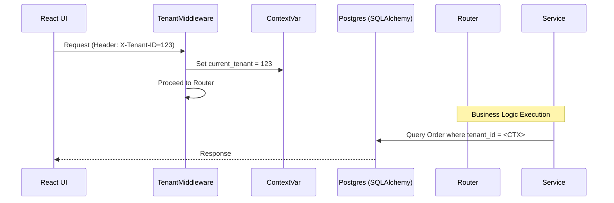

# HLD – Multi-Tenancy Architecture

## Document Information

| Field | Value |
|-------|-------|
| **Feature Name** | Multi-Tenant Foundations (P1-E2) |
| **Status** | Draft |
| **Version** | 1.0 |
| **Date** | 2025-12-25 |
| **Author** | Antigravity |
| **Reference** | Blueprint Section 6 |

---

## 1. Executive Summary

FleetOpsX is a multi-tenant platform. This document defines the strategy for data isolation and tenant resolution. We use a **Single Shared Database** approach where every tenant-specific table contains a `tenant_id` column.

---

## 2. Architecture & Design

### 2.1 Multi-Tenancy Model: Shared Schema

We use a flat multi-tenancy model. Every record is "owned" by a tenant.

```
┌─────────────────────────────────────────────────────────────┐
│                       FleetOpsX DB                          │
├─────────────────────────────────────────────────────────────┤
│  Tenants Table: [id, name, slug]                            │
├─────────────────────────────────────────────────────────────┤
│  Orders Table:  [id, tenant_id, details...]                 │
│                 └── Foreign Key to Tenants                  │
└─────────────────────────────────────────────────────────────┘
```

### 2.2 Tenant Resolution Flow

1. **Request**: UI sends request with `X-Tenant-ID` header.
2. **Middleware**: `TenantMiddleware` extracts the ID.
3. **Context**: ID is stored in a thread-safe `ContextVar`.
4. **Service/Repo**: Data access layers use the context to filter queries.

### 2.3 Component Interaction



---

## 3. Data Model

### 3.1 Table: `tenants`

| Column | Type | Constraints | Description |
|--------|------|-------------|-------------|
| `id` | UUID | PRIMARY KEY | Unique ID |
| `name` | VARCHAR | NOT NULL | Display name |
| `slug` | VARCHAR | UNIQUE | URL/Identifier slug |
| `created_at`| TIMESTAMPTZ | NOW() | |

### 3.2 Table: `tenant_configs`

| Column | Type | Constraints | Description |
|--------|------|-------------|-------------|
| `id` | UUID | PRIMARY KEY | |
| `tenant_id`| UUID | FK(tenants.id) | |
| `key` | VARCHAR | NOT NULL | Config key (e.g. vertical) |
| `value` | JSONB | | Config value |

---

## 4. Implementation Pattern

All SQLAlchemy models must inherit from a `TenantBase` or include a `TenantMixin`:

```python
class TenantMixin:
    tenant_id = Column(UUID, ForeignKey("tenants.id"), nullable=False, index=True)
```

The database session dependency (`get_db`) will be wrapped to ensure that every `SELECT` query automatically appends a `WHERE tenant_id = :current_tenant` clause (or at least enforces it in service layers).
